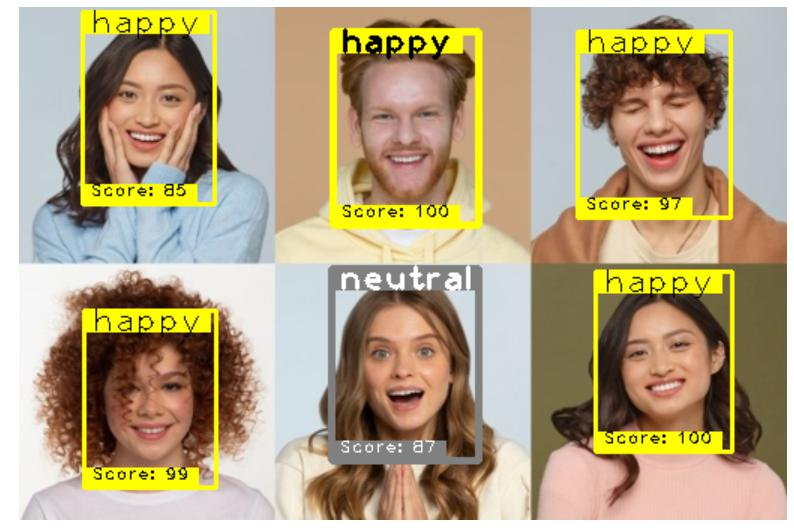
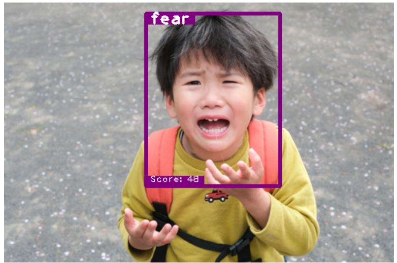
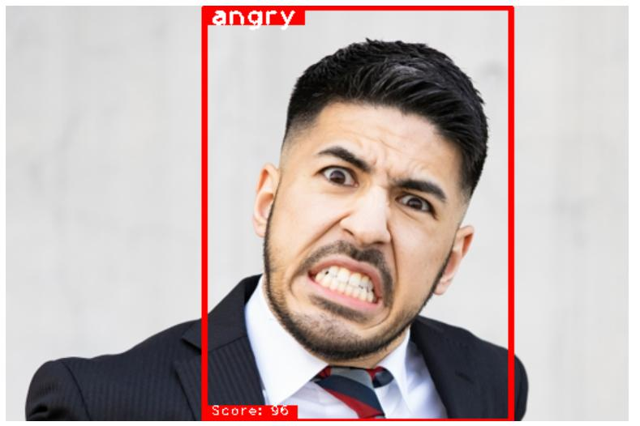
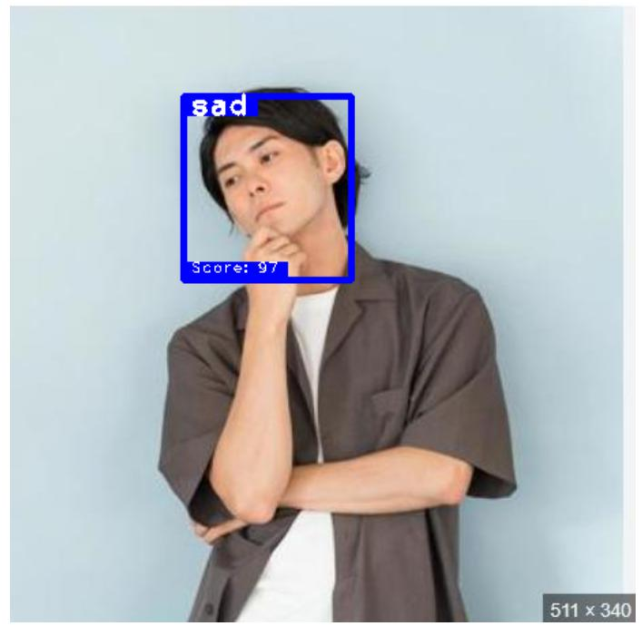
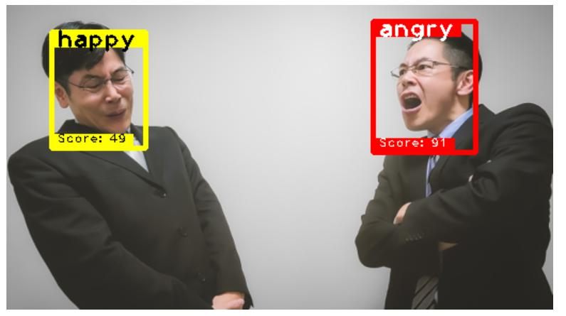
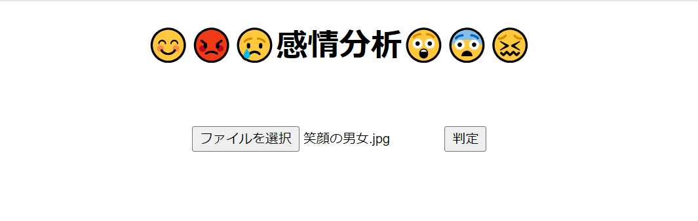
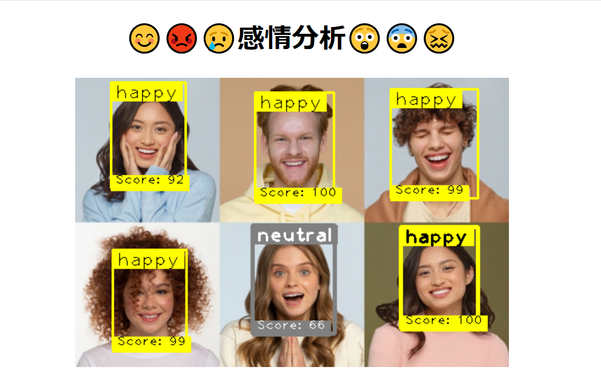

# Happy Face

写真などの画像から、顔検知して感情分析を行います。  
予測した感情と、確信度(Score)を表示します。  
    
    
    
    
    
    


## インストール

1. Git Cloneでプロジェクトをダウンロード。

2. 必要に応じて、仮想環境を有効にします。  
   ```
   python -m venv env` 
   source env/bin/activate (Windowsの場合: env\Scripts\activate)
   ```

   
3. ライブラリのインストールを行ってください。  
   `$ pip install -r ./requirements.txt`   

4. アプリを実行します。  
   `python run.py`


## チュートリアル

1. アプリを起動後、感情分析する画像ファイルを選択して、「判定」ボタンをクリックします。
    

2. 分析結果として、予測された感情とスコアが画像に重ねて表示されます。
    


## 仕様
- 同じ感情のグループで最もスコアが高い顔を、太枠、太字で表示します。
- Scoreは0～100です。
- 以下の7種類の感情に分類します。  
    `['angry', 'disgust', 'fear', 'happy', 'sad', 'surprise', 'neutral']`


## Model
### MTCNN

MTCNNは複数の段階で顔を検知するモデルで、高精度な顔検出が可能です。  
https://github.com/ipazc/mtcnn


### vit-Facial-Expression-Recognition  

Vision Transformerを使った画像分類モデルです。  
`google/vit-base-patch16-224-in21k o`をベースに、FER 2013など表情のデータセットを使って再学習されたものです。  
https://huggingface.co/motheecreator/vit-Facial-Expression-Recognition


## 環境
- Python 3.11.9